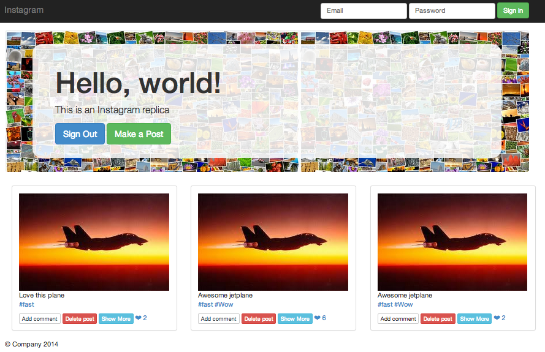

**Instagram replica**

This project is a Ruby on Rails replica of Instagram utilising:

AWS, Devise, Paperclip for image management, Stripe API, Twitter Bootstrap, jQuery, Websockets, Postgres, Rspec, Capybara

**Features**

-Visitors to the homepage can see previously uploaded images

-User management utilising Devise

-Signed in users can upload new images, including a description and tags

-Tags have a many-to-many relationship to posts enabling the user to search posts with the same tag 

-Captions can be added to the pictures

-Users can 'order prints' of images through the Stripe API

-Users can 'like' posts by clicking a heart symbol which is updated without a page refresh using Ajax.  Post requests are made on each click to update at the server level using Web Sockets
